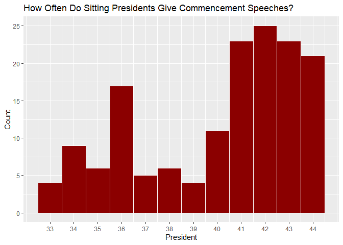

Em’s First README
================

## A GitHub Document of my Very Own!

This is an R Markdown format used for publishing markdown documents to
GitHub. When you click the **Knit** button all R code chunks are run and
a markdown file (.md) suitable for publishing to GitHub is generated.

## Wow! I Can’t Believe I Can Include Code!

You can include R code in the document as follows:

``` r
library(tidyverse)
```

    ## -- Attaching packages --------------------------------------- tidyverse 1.3.1 --

    ## v ggplot2 3.3.5     v purrr   0.3.4
    ## v tibble  3.1.4     v dplyr   1.0.7
    ## v tidyr   1.1.3     v stringr 1.4.0
    ## v readr   2.0.2     v forcats 0.5.1

    ## -- Conflicts ------------------------------------------ tidyverse_conflicts() --
    ## x dplyr::filter() masks stats::filter()
    ## x dplyr::lag()    masks stats::lag()

``` r
library(fivethirtyeight)
summary(pres_commencement)
```

    ##       pres       pres_name            title                date           
    ##  Min.   :33.0   Length:154         Length:154         Min.   :1969-06-04  
    ##  1st Qu.:37.0   Class :character   Class :character   1st Qu.:1991-05-15  
    ##  Median :41.0   Mode  :character   Mode  :character   Median :2001-11-27  
    ##  Mean   :40.1                                         Mean   :2011-06-14  
    ##  3rd Qu.:43.0                                         3rd Qu.:2014-06-13  
    ##  Max.   :44.0                                         Max.   :2068-08-24  
    ##      city              state             building             room          
    ##  Length:154         Length:154         Length:154         Length:154        
    ##  Class :character   Class :character   Class :character   Class :character  
    ##  Mode  :character   Mode  :character   Mode  :character   Mode  :character  
    ##                                                                             
    ##                                                                             
    ## 

## You Thought You’d Seen the End of Me? It’s ggplot

You can also embed plots, for example:

<!-- -->

It turns out, if you try to plot by x = date, that Presidents Truman,
Eisenhower, Kennedy, and Johnson all gave speeches through 2068, so I
organized by number of presidency instead, such that Truman = 33,
Eisenhower = 34… Obama = 44.

Note that the `echo = FALSE` parameter was added to the code chunk to
prevent printing of the R code that generated the plot.
